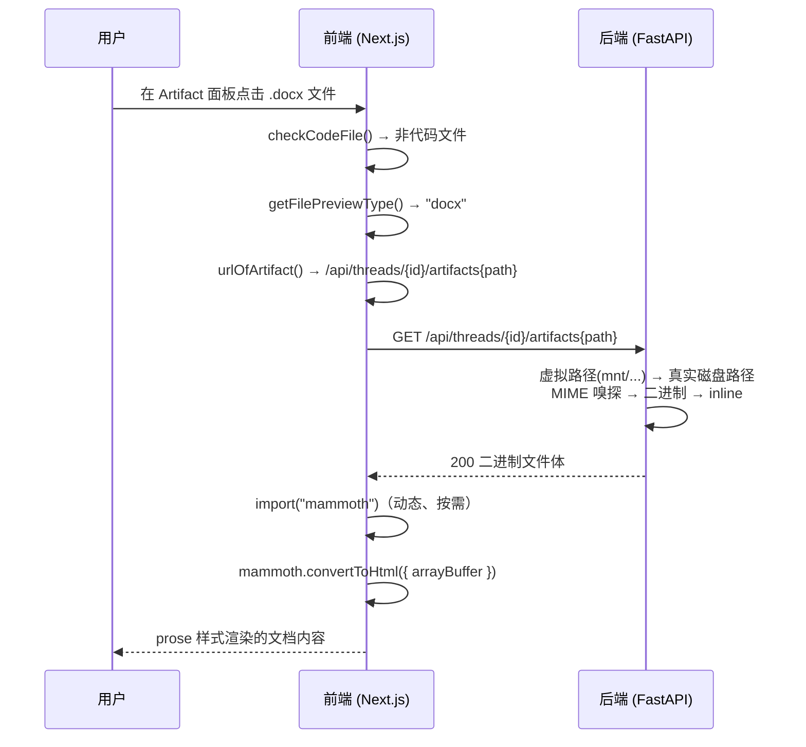

# 前端 DOCX 预览实现指南

> 本文档基于本项目 `frontend/src/components/workspace/artifacts/file-previews.tsx` 的真实实现整理而成。
> 解析使用 [Mammoth](https://mammoth.js.org/)（npm 包名 `mammoth`），在浏览器端把 `.docx` 转成语义 HTML，再以 Prose 样式渲染。

---

## 目录

- [技术方案概览](#技术方案概览)
- [端到端链路](#端到端链路)
- [1. 安装依赖](#1-安装依赖)
- [2. 完整组件代码](#2-完整组件代码)
- [3. 使用示例](#3-使用示例)
- [4. 关键 API 速查](#4-关键-api-速查)
- [5. 项目中的真实实现](#5-项目中的真实实现)
- [6. 限制与注意事项](#6-限制与注意事项)
- [7. 安全提示](#7-安全提示)

---

## 技术方案概览

| 项目 | 说明 |
|------|------|
| 解析库 | Mammoth（`mammoth`），版本 `^1.12.0` |
| 转换方式 | 浏览器端 `mammoth.convertToHtml()`，OOXML → 语义 HTML |
| 渲染方式 | `dangerouslySetInnerHTML` 注入 + Tailwind Typography（`prose`）排版 |
| 加载策略 | `await import("mammoth")` 动态导入，按需打包 |
| 支持格式 | `.docx`（路由表中同时映射了 `.doc`，但 Mammoth 不支持老式二进制 `.doc`，见[限制](#6-限制与注意事项)） |
| 文件来源 | 后端 artifact 接口 `GET /api/threads/{threadId}/artifacts/{path}`，以 `inline` 方式返回二进制 |

**核心流程：**

```
用户在 Artifact 面板点击 .docx 文件
→ ArtifactFileDetail 判断非代码文件 → getFilePreviewType() 返回 "docx"
→ urlOfArtifact() 拼出后端 URL
→ DocxPreview: fetch(url) → arrayBuffer
→ mammoth.convertToHtml({ arrayBuffer }) → HTML 字符串
→ dangerouslySetInnerHTML 渲染到 prose 容器
```

与 Excel 预览（SheetJS）同属一个文件类型路由器 `FilePreview`，二者共享同一套加载/错误处理模式。

---

## 端到端链路



涉及的三个关键环节：

1. **URL 构建**（`frontend/src/core/artifacts/utils.ts`）：
   `urlOfArtifact()` 返回 `{backendBaseURL}/api/threads/{threadId}/artifacts{filepath}`，
   静态演示模式下走 `/demo/threads/...`，mock 模式走 `/mock/api/...`。
2. **后端文件服务**（`backend/app/gateway/routers/artifacts.py` 的 `get_artifact`）：
   把 `mnt/user-data/outputs/...` 这类虚拟路径解析到线程工作区中的真实文件；
   `.docx` 的 MIME 为 `application/vnd.openxmlformats-officedocument.wordprocessingml.document`，
   非 `text/*` 且内容含空字节，因此走二进制分支，以 `Content-Disposition: inline` 整体返回。
3. **前端解析渲染**（`file-previews.tsx` 的 `DocxPreview`）：见下文完整代码。

---

## 1. 安装依赖

```bash
pnpm add mammoth
# 或
npm install mammoth
# 或
yarn add mammoth
```

Mammoth 自带浏览器构建（纯 JS 解析 ZIP + XML，不需要 Node 环境），可直接在客户端组件中使用。

---

## 2. 完整组件代码

> 文件路径建议：`frontend/src/components/workspace/artifacts/DocxPreview.tsx`

```tsx
"use client";

import { useEffect, useState } from "react";
import { LoaderIcon } from "lucide-react";

// ---------------------------------------------------------------------------
// DOCX 预览组件（mammoth：浏览器端 OOXML → 语义 HTML）
// 用法：<DocxPreview url="/files/demo.docx" />
// ---------------------------------------------------------------------------
export function DocxPreview({ url }: { url: string }) {
  const [html, setHtml] = useState<string | null>(null);
  const [error, setError] = useState<string | null>(null);

  useEffect(() => {
    let cancelled = false;
    async function load() {
      try {
        // 动态导入：只有真正预览时才把 mammoth 打进 bundle
        const mammoth = await import("mammoth");
        const res = await fetch(url);
        const buf = await res.arrayBuffer();
        const result = await mammoth.convertToHtml({ arrayBuffer: buf });
        if (!cancelled) setHtml(result.value);
      } catch (e: unknown) {
        if (!cancelled) setError(e instanceof Error ? e.message : "Failed to load");
      }
    }
    load();
    return () => { cancelled = true; };
  }, [url]);

  if (error) return <div className="p-4 text-sm text-red-500">{error}</div>;
  if (!html) return (
    <div className="flex items-center justify-center p-8">
      <LoaderIcon className="size-5 animate-spin" />
    </div>
  );

  return (
    <div
      className="size-full overflow-auto p-6 prose prose-sm dark:prose-invert max-w-none"
      dangerouslySetInnerHTML={{ __html: html }}
    />
  );
}
```

实现要点：

- **`cancelled` 标志**：组件卸载或 `url` 变化时丢弃迟到的异步结果，避免对已卸载组件 `setState`。
- **三态渲染**：`error` → 红色错误文案；`html === null` → loading 图标；否则渲染内容。
- **`prose prose-sm dark:prose-invert`**：复用 Tailwind Typography 为 Mammoth 输出的
  `h1~h6 / p / ul / ol / table / img / a` 提供统一排版，并自动适配暗色模式。
- **`max-w-none`**：覆盖 prose 默认的最大宽度限制，让文档占满预览面板。

---

## 3. 使用示例

配合文件类型路由器使用（即项目中的真实用法）：

```tsx
import { DocxPreview } from "./DocxPreview";

// 直接预览一个 URL
<DocxPreview url="https://example.com/report.docx" />

// 或从后端 artifact 接口取文件
const url = `${backendBaseURL}/api/threads/${threadId}/artifacts${filepath}`;
<DocxPreview url={url} />
```

本地开发时准备测试文件：让 Agent 生成（或手工放置）一个 `.docx` 到
`/mnt/user-data/outputs/`，在会话的 Artifact 文件列表中点击即可预览。

---

## 4. 关键 API 速查

### `mammoth.convertToHtml(input, options?)`

| 参数 | 类型 | 说明 |
|------|------|------|
| `input.arrayBuffer` | `ArrayBuffer` | 文件二进制内容（浏览器用法） |
| `options.styleMap` | `string[]` | 自定义样式映射，如 `\"p[style-name='Title'] => h1:fresh\"` |
| `options.includeDefaultStyleMap` | `boolean` | 是否附带默认映射，默认 `true` |
| `options.ignoreEmptyParagraphs` | `boolean` | 忽略空段落，默认 `true` |
| `options.convertImage` | `function` | 自定义图片转换（默认转 base64 data URI 的 ``） |

**返回值** `Promise<Result>`：

| 字段 | 类型 | 说明 |
|------|------|------|
| `value` | `string` | 转换得到的 HTML 字符串 |
| `messages` | `Message[]` | 转换警告（如不支持的样式被丢弃），当前实现未展示 |

**默认样式映射**（语义转换，非保真排版）：

| Word 元素 | HTML 输出 |
|-----------|-----------|
| 标题 1~6（Heading 样式） | `<h1>` ~ `<h6>` |
| 普通段落 | `<p>` |
| 粗体 / 斜体 / 下划线 | `<strong>` / `<em>` / `<u>` |
| 列表（含多级） | `<ul>` / `<ol>` / `<li>` |
| 表格 | `<table>` `<tr>` `<td>` |
| 超链接 | `<a href>` |
| 内嵌图片 | `` |
| 换行（Shift+Enter） | `<br>` |

---

## 5. 项目中的真实实现

| 关注点 | 位置 |
|--------|------|
| DocxPreview 组件 | `frontend/src/components/workspace/artifacts/file-previews.tsx` |
| 文件类型路由 | 同上文件 `getFilePreviewType()`：`["doc", "docx"] → "docx"` |
| 预览入口（非代码文件分支） | `frontend/src/components/workspace/artifacts/artifact-file-detail.tsx`（`!isCodeFile` 分支） |
| artifact URL 构建 | `frontend/src/core/artifacts/utils.ts` `urlOfArtifact()` |
| 文件服务端点 | `backend/app/gateway/routers/artifacts.py` `GET /api/threads/{thread_id}/artifacts/{path:path}` |
| 依赖声明 | `frontend/package.json`：`"mammoth": "^1.12.0"` |

路由分支（`artifact-file-detail.tsx`）：

```tsx
{!isCodeFile && (() => {
  const previewType = getFilePreviewType(filepath);          // "docx"
  const artifactUrl = urlOfArtifact({ filepath, threadId, isMock });
  if (previewType) {
    return <FilePreview filepath={filepath} url={artifactUrl} />;
  }
  return <iframe className="size-full" src={artifactUrl} />; // 兜底：iframe 直接打开
})()}
```

`FilePreview` 内部按类型分发（`file-previews.tsx`）：

```tsx
export function getFilePreviewType(filepath: string): FilePreviewType {
  const ext = filepath.split(".").pop()?.toLowerCase() ?? "";
  if (["xlsx", "xls", "csv"].includes(ext)) return "excel";
  if (["doc", "docx"].includes(ext)) return "docx";
  if (["png", "jpg", "jpeg", "gif", "svg", "webp", "bmp", "ico"].includes(ext)) return "image";
  if (ext === "pdf") return "pdf";
  return null;
}
```

---

## 6. 限制与注意事项

| 限制 | 说明 | 建议 |
|------|------|------|
| **不支持 `.doc`** | Mammoth 只能解析 OOXML（`.docx`）。当前路由把 `.doc` 也映射到 `docx` 分支，老式二进制 `.doc` 会在运行时报错并显示错误文案 | 如需支持 `.doc`，可在后端用 LibreOffice 等先转 `.docx`，或前端检测后走下载兜底 |
| **非保真排版** | Mammoth 是"语义转换"：字体、颜色、页眉页脚、分栏、文本框、复杂表格样式等会被丢弃或简化 | 需要保真预览时改用后端转 PDF + 浏览器原生 PDF 渲染（本项目 PDF 分支即 `<iframe>`） |
| **图片转 base64** | 文档内嵌图片全部转成 data URI 内联，多图大文档会显著增加内存与 DOM 体积 | 大文档可通过 `convertImage` 选项改为上传后引用 URL |
| **`messages` 未展示** | 转换警告（被丢弃的样式等）当前被忽略 | 可在调试时打印 `result.messages` |
| **无虚拟滚动** | 整篇 HTML 一次性注入，超长文档渲染开销大 | 超大文档可考虑分页或懒渲染 |

与上传侧的区分：用户上传的 `.doc/.docx` 在后端另有
`backend/packages/harness/deerflow/utils/file_conversion.py`
（MarkItDown）转成 Markdown 供 Agent 阅读 —— 那是 **LLM 上下文摄取链路**，
与本文档描述的 **前端预览链路** 相互独立。

---

## 7. 安全提示

- **`dangerouslySetInnerHTML`**：Mammoth 输出的 HTML 被直接注入 DOM。Mammoth
  本身会对文本内容转义、默认不透传 Word 中的原始 HTML，风险较低，但升级依赖或
  启用自定义 `styleMap`/`convertImage` 时需审查输出是否可被文档作者注入脚本。
  更严格的方案是先经 DOMPurify 消毒再注入。
- **图片为 data URI**：不发起外部请求，无外链泄露；但也意味着内容完全进入内存。
- **后端侧防护**：artifact 接口做了虚拟路径解析（防路径穿越）、权限校验
  （`@require_permission("threads", "read", owner_check=True)`），二进制以
  `inline` 返回；HTML/XHTML/SVG 等"活动内容"则强制 `attachment` 下载，
  防止在应用源下执行脚本。`.docx` 属于二进制直返，不在此列。
